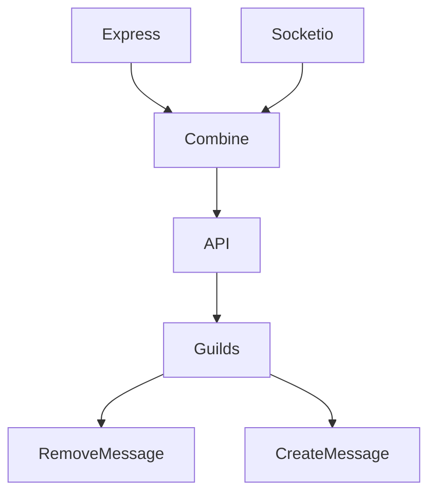

# Pingcord

## What is Pingcord?

Pingcord is ment to be a chatapp

## Bot support?

We do plan to support both Bots and so called "Selfbots"
We plan to 

# Pingcord

## FAQ

### What is Pingcord?

Pingcord is ment to be a chatapp

### Bot support?

We do plan to support both Bots and so called "Selfbots"
Selfbots will have a tag on them (This is not 100% set yet and can change)

### How will the API work?

The API will work VIA having both websockets (Socket.IO) and GET/POST requests

### When will Pingcord come out?

We aren't sure

# API Layout

# Contributors 

[AirplaneGobrr](https://github.com/AirplaneGobrr) - Lead Developer